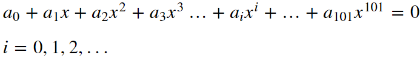

## A polynomial:  


## Task:  
Solve the polynomial (in **.dat** files) using both mpmath and Mathematica.

## Results:  

### Roots (real and negative):  
```
-3.25646424490722525403605656288886     
-0.39942617065535109728006890201645     
-0.02563590921469356448052755661023
```

### Processing times:
1. mpmath 
  ```
  CPU times: user 1min 9s, sys: 456 ms, total: 1min 10s
  Wall time: 1min 10s
  ```  
2. Mathematica
  ```
  639.426 ms
  ```  
  
## Conclusion:
tmp = 1min 10s = 70s = 70000 ms  
tma = 639.426 ms  
tmp/tma = 109.473  

Mathematica seems almost 110x faster than mpmath.
